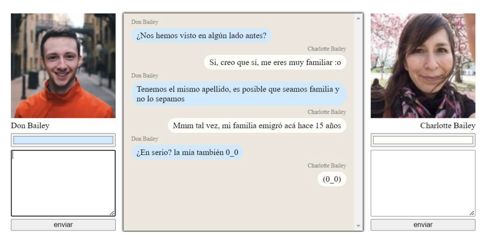

# Desafío: Consumo de datos desde una API REST

### Introducción

En este desafío, se validarán los conocimientos sobre el consumo de API’s mediante la creación de una mini aplicación de chat. La aplicación permitirá el diálogo entre dos desconocidos, cuyos perfiles serán obtenidos a través de la API Random User.

### Descripción del Proyecto

La mini aplicación de chat debe cumplir con los siguientes requisitos:

1. Obtener Usuarios Aleatorios: Al cargar la aplicación, se deben obtener dos usuarios aleatorios a través de la API Random User.  
2. Enviar Mensajes: 
* Cada usuario debe poder enviar un mensaje al chat.  
* El mensaje debe tener un contenido textual y un color representativo.

3. Visualización del Chat: El chat debe ser un componente hijo que expone todos los mensajes indicando el nombre del propietario en cada uno.

### Requerimientos Técnicos

1. Consumo de la API con Axios:

* Utilizar Axios para realizar las solicitudes a la API  Random User.  
* API Random User  

2. Ciclo de Vida de los Componentes: Usar el ciclo de vida de los componentes para obtener la información de los usuarios al cargar la aplicación.  

3. Eventos e Interacciones: Implementar eventos que permitan el registro de nuevos mensajes en el chat.  

4. Estilos y Clases Dinámicas: Aplicar style y/o class binding para el direccionamiento y el color de fondo de los mensajes según corresponda a su propietario.

### Puntos a Evaluar

1. Uso de Axios:  
* Correcto consumo de la API Random User utilizando Axios.

2. Ciclo de Vida de Componentes:  
* Correcta implementación del ciclo de vida de los componentes para la obtención de usuarios al cargar la aplicación.

3. Eventos para Nuevos Mensajes:
* Implementación de eventos que permitan agregar nuevos mensajes al chat.

4. Estilo y Clase de los Mensajes:
* Aplicación de estilos y clases para diferenciar y personalizar los mensajes según el propietario.

### Recursos

- API Random User: https://randomuser.me/
- Axios: https://axios-http.com/

